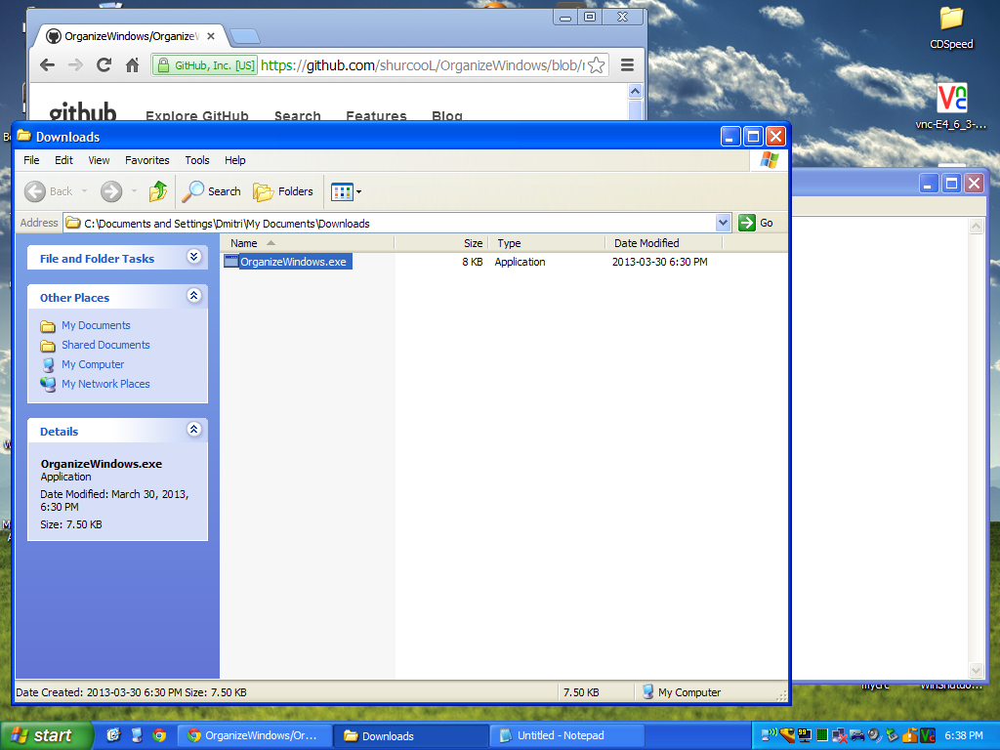
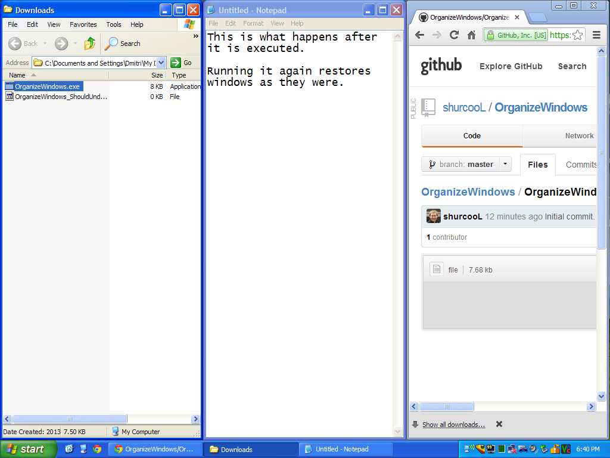

OrganizeWindows
===============

When executed multiple times, it alternates between performing `Show windows side by side` and `Undo Show side by side` operations.

Running this .exe is equivalent to manually right clicking the taskbar and selecting the appropriate operation, but this .exe can be assigned to a keyboard shortcut or a trackpad gesture.

Download: [OrganizeWindows.exe](https://github.com/shurcooL/OrganizeWindows/blob/master/OrganizeWindows.exe)

Compatibility
-------------

- Windows 8
- Windows 7
- Windows Vista
- Windows XP
